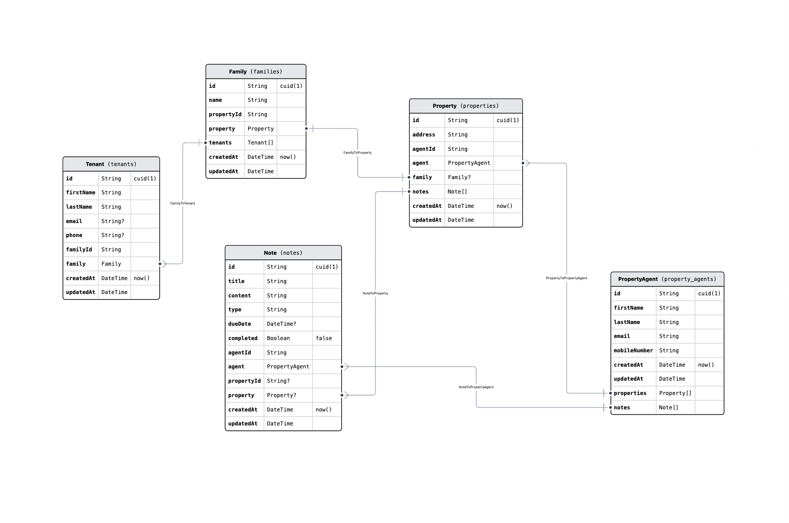
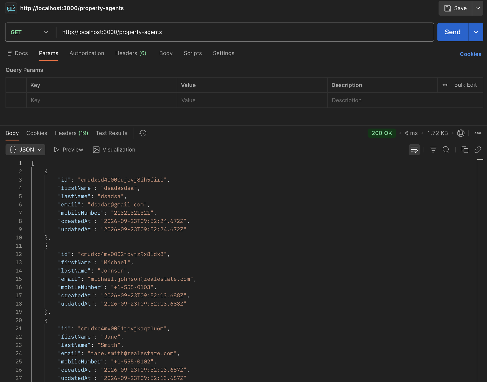
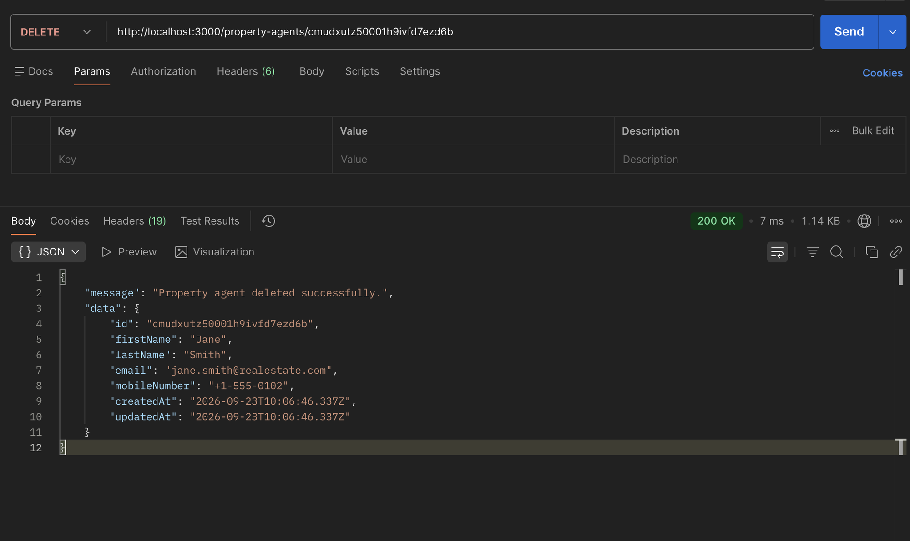

# Property Management Monorepo

A Turborepo containing a NestJS + Prisma API and a Vue 3 front end for managing
property agents, their properties, the families renting them, and follow-up notes.

```
apps/
  api/      NestJS 12 + Prisma (SQLite)   -> http://localhost:3000
  web/      Vue 3 + Vite + shadcn-vue     -> http://localhost:3001
packages/
  api/            shared DTO/contract scaffold (@repo/api)
  ui/             shared React component package (@repo/ui)
  eslint-config/  shared flat ESLint configs
  jest-config/    shared Jest presets
  typescript-config/  shared tsconfig bases
```

## Getting started

Requires **Bun 1.3** (the repo pins it via `devEngines`; `npm install` is refused).

```bash
bun install
bunx turbo run dev        # starts api on :3000 and web on :3001
```

Or run one app at a time:

```bash
cd apps/api && bun run dev
cd apps/web && bun run dev
```

Open http://localhost:3001 for the UI. The API is reachable directly on
http://localhost:3000.

---

## Data model



The schema is defined in `apps/api/prisma/schema.prisma`. Every model uses a
`cuid()` primary key and `createdAt` / `updatedAt` timestamps, and each maps to a
snake_case table via `@@map`.

**`PropertyAgent` (`property_agents`)** is the root of the graph. An agent has a
name, a unique `email`, and a `mobileNumber`. Everything else hangs off an agent
either directly or transitively. The unique constraint on `email` is what makes a
duplicate create return `409` rather than silently adding a second record.

**`Property` (`properties`)** is a physical address owned by exactly one agent
(`agentId`). An agent has many properties.

**`Family` (`families`)** is the household renting a property. This is a genuine
one-to-one: `propertyId` is marked `@unique`, so a property has at most one family
and a family belongs to exactly one property.

**`Tenant` (`tenants`)** is an individual person within a family. A family has many
tenants. `email` and `phone` are optional here — unlike on the agent — because
tenant contact details are often incomplete.

**`Note` (`notes`)** is a piece of follow-up work: maintenance, pest control, a
reminder. A note always belongs to an agent (`agentId`), and _optionally_ to a
property (`propertyId` is nullable), which allows for general agent to-dos that
are not tied to any one address.

### Delete behaviour

The cascade rules encode the ownership above, and are worth knowing before you
delete anything:

| Relation                     | On delete                                                  |
| ---------------------------- | ---------------------------------------------------------- |
| `Property` → `PropertyAgent` | **Cascade** — deleting an agent deletes their properties   |
| `Family` → `Property`        | **Cascade** — deleting a property deletes its family       |
| `Tenant` → `Family`          | **Cascade** — deleting a family deletes its tenants        |
| `Note` → `PropertyAgent`     | **Cascade** — deleting an agent deletes their notes        |
| `Note` → `Property`          | **SetNull** — deleting a property keeps the note, detached |

So deleting one agent can remove their properties, those properties' families, and
those families' tenants, in a single cascade.

### How the database is created

There are currently **no Prisma migrations**. `PrismaService.onModuleInit()` creates
the tables with raw `CREATE TABLE IF NOT EXISTS` statements and then seeds sample
data (3 agents, 5 properties, 4 families, 7 tenants, 6 notes). See
[Known gaps](#known-gaps) — this has real consequences for anything you enter by hand.

---

## How the app is put together

A create from the browser travels like this:

```
Vue form (form.vue)
  └─ usePropertyAgentForm  ── zod validation, client side
      └─ lib/api/property-agents.ts  ── fetch POST /api/property-agents
          └─ Vite dev proxy  ── strips /api, forwards to :3000
              └─ Nest ValidationPipe  ── class-validator, rejects bad/unknown fields
                  └─ PropertyAgentsController  ── HTTP only
                      └─ PropertyAgentsService  ── business rules, Prisma
                          └─ PrismaClientExceptionFilter  ── constraint errors → HTTP
```

### Front end (`apps/web`)

Vue 3 `<script setup>` with shadcn-vue components. Form state, validation and
submission live in the `usePropertyAgentForm` composable, so `form.vue` stays
presentational. Validation rules are a zod schema in `src/schemas/property-agent.ts`.
`src/lib/api/property-agents.ts` owns all HTTP concerns and translates failures into a
single `ApiError` type.

Requests go to the relative path `/api/...`. `vite.config.ts` proxies that to
`http://localhost:3000` **server side** and strips the prefix — which is why the
browser never makes a cross-origin request in development.

### API (`apps/api`)

| Layer                           | Responsibility                                 |
| ------------------------------- | ---------------------------------------------- |
| `property-agents.controller.ts` | Routing and status codes only — no logic       |
| `property-agents.service.ts`    | Business rules and all Prisma access           |
| `property-agents.mapper.ts`     | Prisma `select` sets + row → response mapping  |
| `dto/`                          | Request shapes with class-validator decorators |
| `common/filters/`               | Prisma error → HTTP status translation         |
| `common/validators/`            | Custom rules (e.g. mobile number digit count)  |
| `common/responses/`             | The `{ message, data }` envelope helper        |

Two things are registered globally in `app.module.ts` rather than `main.ts`:

- **`APP_PIPE`** — a `ValidationPipe` with `whitelist`, `forbidNonWhitelisted` and
  `transform`. Unknown body fields are rejected, so `id` or `createdAt` cannot be
  mass-assigned through a request.
- **`APP_FILTER`** — `PrismaClientExceptionFilter`, mapping `P2002` → `409` and
  `P2025` → `404`.

Registering them in the module rather than at bootstrap means the e2e tests, which
build the app from `AppModule`, exercise the real pipe and the real filter.

Responses are never raw Prisma models. The mapper uses an explicit `select`, so the
database only ever reads the columns that are meant to be returned.

`main.ts` owns transport concerns only: helmet, a CORS allowlist driven by
`CORS_ORIGINS`, shutdown hooks (so Prisma disconnects cleanly), and the port. Env
vars are validated at boot in `src/config/env.validation.ts` — a bad `PORT` fails
startup instead of surfacing later.

---

## API endpoints

Base URL `http://localhost:3000`. Every response is wrapped in an envelope:

```jsonc
{ "message": "...", "data": {/* or [ ... ] */} }
```

| Method   | Path                   | Success | Description                          |
| -------- | ---------------------- | ------- | ------------------------------------ |
| `POST`   | `/property-agents`     | `201`   | Create an agent                      |
| `GET`    | `/property-agents`     | `200`   | List all agents                      |
| `GET`    | `/property-agents/:id` | `200`   | One agent, with properties and notes |
| `PATCH`  | `/property-agents/:id` | `200`   | Partial update                       |
| `DELETE` | `/property-agents/:id` | `200`   | Delete, returns the deleted record   |

### `GET /property-agents`

Returns every agent as a flat list. Relations are deliberately excluded here — use
`GET /property-agents/:id` when you need an agent's properties and notes.



### `DELETE /property-agents/:id`

Deletes the agent and returns the record that was removed, so the caller can show
what was deleted or offer an undo. Note the cascade rules above: this also removes
the agent's properties, their families, and those families' tenants.



### Request body

`POST` requires all four fields; `PATCH` accepts any subset of them.

```json
{
  "firstName": "Ada",
  "lastName": "Lovelace",
  "email": "ada@example.com",
  "mobileNumber": "+1 (555) 010-1234"
}
```

Validation rules: `firstName` / `lastName` 1–100 characters, `email` a valid address
under 255 characters and unique across agents, `mobileNumber` **10–15 digits**
(digits are counted, so formatting characters `+ - ( )` and spaces are allowed).

### Errors

| Status | When                                                                                        |
| ------ | ------------------------------------------------------------------------------------------- |
| `400`  | Validation failed, or the body contained an unknown field. `message` is an array of strings |
| `404`  | No agent with that id                                                                       |
| `409`  | An agent with that email already exists                                                     |

```bash
curl -X POST http://localhost:3000/property-agents \
  -H 'Content-Type: application/json' \
  -d '{"firstName":"Ada","lastName":"Lovelace","email":"ada@example.com","mobileNumber":"+1 (555) 010-1234"}'
```

---

## Quality gates

```bash
bunx turbo run check-types   # tsc across every workspace
bunx turbo run lint
cd apps/api && bun run test       # unit tests, mocked Prisma
cd apps/api && bun run test:e2e   # supertest against a real app instance
```

`apps/api` type-checks its specs as well as its source (`tsconfig.spec.json`), so a
test referencing a method that no longer exists fails the build.

---
